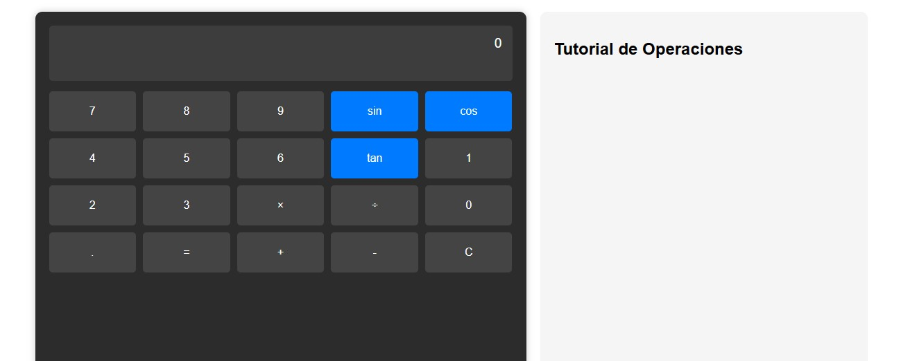

# Calculadora Científica con Tutoriales Interactivos

## Descripción del Proyecto
Aplicación web que combina una calculadora científica funcional con un sistema de tutoriales interactivos. Permite realizar operaciones matemáticas básicas y funciones trigonométricas (seno, coseno, tangente), mostrando explicaciones detalladas de cada cálculo y generando gráficas visuales para funciones trigonométricas.

---

## Características Principales
### 1. Operaciones Básicas
- Suma, resta, multiplicación y división
- Entrada numérica mediante botones o teclado
- Sistema de memoria para operaciones complejas

### 2. Funciones Científicas
- Cálculo de seno, coseno y tangente
- Conversión automática de grados a radianes
- Visualización de resultados con 4 decimales

### 3. Tutoriales Interactivos
- Explicaciones paso a paso de cada operación
- Descripción de conceptos matemáticos asociados
- Ejemplos prácticos integrados

### 4. Gráficas Dinámicas
- Generación automática de gráficas para funciones trigonométricas
- Escala interactiva con sistema de coordenadas
- Representación visual en tiempo real
